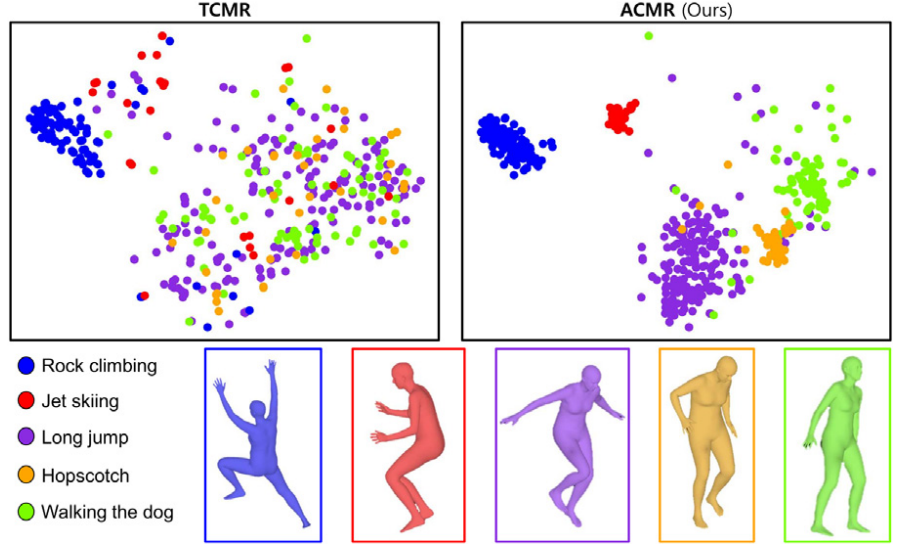

# Action-conditioned Contrastive Learning for 3D Human Pose and Shape Estimation In Videos

## Abstract




The aim of this research is to estimate 3D human pose and shape in videos, which is a challenging task due to the complex nature of the human body and the wide range of possible pose and shape variations. This problem also poses difficulty in finding a satisfactory solution due to the trade-off between the accuracy and temporal consistency of the estimated 3D pose and shape. Thus previous researches have prioritized one objective over the other. In contrast, we propose a novel approach called the action-conditioned mesh recovery (ACMR) model, which improves accuracy without compromising temporal consistency by leveraging human action information. Our ACMR model outperforms existing methods that prioritize temporal consistency in terms of accuracy, while also achieving comparable temporal consistency with other state-of-the-art methods. Significantly, the action-conditioned learning process occurs only during training, requiring no additional resources at inference time, thereby enhancing performance without increasing computational demands.


## Introduction
This repository provides the [PyTorch](https://pytorch.org/) implementation of our paper [Action-conditioned contrastive learning for 3D human pose and shape estimation in videos](https://www.sciencedirect.com/science/article/pii/S1077314224002303?casa_token=52B88cejnvUAAAAA:NMZw6JLFRyUK_1q9GSqOKOdTKa1xk5mV3HWuFFIDGeudvFWWvJaJQX1aXs6l6AQL2loeM0kWYA). 
The implementation builds upon the excellent work of [TCMR](https://github.com/hongsukchoi/TCMR_RELEASE).

## Dataset Preparation
Please follow the dataset preparation steps from [TCMR](https://github.com/hongsukchoi/TCMR_RELEASE).
For action pseudo-labels, we used SlowFast through [MMAction2](https://github.com/open-mmlab/mmaction2). You can either:
- Use our pre-processed pt files that include action labels, or
- Set up MMAction2 and utilize the demo code in trainer to generate pseudo action labels

## Demo
1. Download the ACMR weights from [here](https://1drv.ms/u/s!ApS00rGYsiGRi-QrwtqM8likFZtHMQ?e=Gcrvhb)
2. Run demo.py with your input frame folder

## Citation
If you find this work useful, please consider citing:
```
@article{song2024action,
  title={Action-conditioned contrastive learning for 3D human pose and shape estimation in videos},
  author={Song, Inpyo and Ryu, Moonwook and Lee, Jangwon},
  journal={Computer Vision and Image Understanding},
  volume={249},
  pages={104149},
  year={2024},
  publisher={Elsevier}
}
```

## Acknowledgments

This work builds upon several excellent previous works. We sincerely thank the authors of:

- [I2L-MeshNet_RELEASE](https://github.com/mks0601/I2L-MeshNet_RELEASE)
- [3DCrowdNet_RELEASE](https://github.com/hongsukchoi/3DCrowdNet_RELEASE)
- [TCMR_RELEASE](https://github.com/hongsukchoi/TCMR_RELEASE)
- [Hand4Whole_RELEASE](https://github.com/mks0601/Hand4Whole_RELEASE)
- [HandOccNet](https://github.com/namepllet/HandOccNet)
- [NeuralAnnot_RELEASE](https://github.com/mks0601/NeuralAnnot_RELEASE)